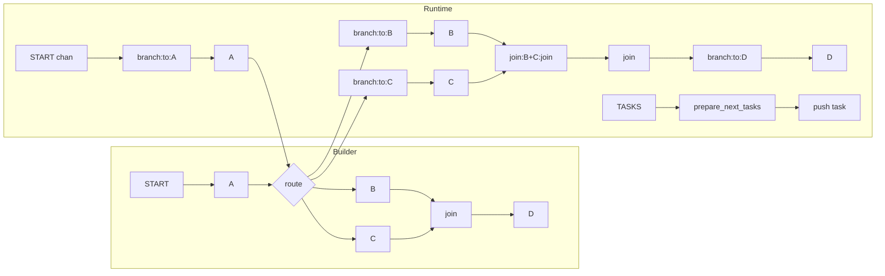

# Control Flow Is Channels Too

The companion page [03-your-state-compiles-to-channels](./03-your-state-compiles-to-channels.md) covers state lowering. This page covers the other half of `compile()`: how graph topology becomes runtime channels, subscriptions, and write instructions. The builder graph describes reachability through edges and branches; the runtime sees only channels, `PregelNode` objects subscribed to those channels, and writers that emit the next updates.

Control flow becomes data flow. A builder edge such as `A -> B` does not survive as a standalone scheduling rule. `compile()` turns it into a write to B's trigger channel, so the next planning pass decides whether B runs from channel activity rather than from a remembered edge list.

## Runtime model

`CompiledStateGraph.attach_node` in `libs/langgraph/langgraph/graph/state.py` wraps each user node in a `PregelNode` from `libs/langgraph/langgraph/pregel/_read.py`. That object carries the channels the node reads, the trigger channels that wake it, the writers that run after the bound runnable finishes, and the bound runnable itself. Nothing calls the node directly; a value on its trigger channel makes the scheduler pick it up in the next planning phase, following the version-based rule described in [02-what-runs-next](./02-what-runs-next.md).

The trigger channel uses the implementation naming scheme `branch:to:<node>`. Regular nodes get an `EphemeralValue` trigger channel, while deferred nodes use `LastValueAfterFinish` so the trigger survives until graph finish instead of disappearing at the end of the step.

## Edge lowerings

Plain edge `A -> B`: `attach_edge` adds a `ChannelWrite` entry to A's writers so A writes to B's trigger channel. The graph keeps the edge as a builder fact, but runtime scheduling only sees the trigger write that the edge produces.

Fan-in edge `[A, B, C] -> D`: `attach_edge` registers a `NamedBarrierValue` join channel named from the full start set and D subscribes to that barrier. Each predecessor writes its own name when it finishes, and the barrier stays unreadable until the named set is complete. If D defers, `NamedBarrierValueAfterFinish` keeps the same join alive until graph finish.

Conditional edge: `BranchSpec` stores the routing callable, and `attach_branch` runs it during the source node's write phase. The branch code decides which target trigger channels receive writes, or which `Send` packets enter the system. The engine does not walk a branch tree later; it already made the routing decision at write time.

`START`: the entrypoint is just a node subscribed to `START`, and `invoke()` writes user input into that channel. The first superstep then follows the same trigger and scheduling path as any other node. The end-to-end trace in [01-anatomy-of-an-invoke](./01-anatomy-of-an-invoke.md) shows that path from the initial write onward.

## Dynamic fan-out with `Send`

A node that returns `Send(node, arg)` objects does not follow edges at all. `BranchSpec` can return those packets, `_control_branch` writes them to the reserved `TASKS` topic channel, and `prepare_next_tasks` drains `TASKS` into one push task per packet. Each push task carries its own private input instead of the shared graph state, which gives `Send` its map-reduce shape.

That flow creates two task flavors. Subscription-driven pull tasks advance when trigger-channel writes make a node visible to the scheduler. Packet-driven push tasks advance when `prepare_next_tasks` drains queued `Send` packets from `TASKS`. The runtime keeps both forms under one scheduler because both forms reduce to channel activity.

See the official [graph API](https://docs.langchain.com/oss/python/langgraph/graph-api) for edge and conditional-edge usage, and the official [use-graph-api page](https://docs.langchain.com/oss/python/langgraph/use-graph-api) for the `Send` map-reduce recipe.

## `Command`

`Command` lowers into the same channel machinery. `attach_node` turns `Command.update` into state writes, and `_control_branch` turns `goto` into channel writes that route to trigger channels or queued sends. `Command(graph=Command.PARENT)` does not stop inside the child graph; the compiled machinery raises `ParentCommand` so the parent graph handles the command at the boundary.

For usage, see the official [graph API](https://docs.langchain.com/oss/python/langgraph/graph-api) for `Command` and the official [use-subgraphs page](https://docs.langchain.com/oss/python/langgraph/use-subgraphs) for cross-boundary behavior.

## Why this lowering matters

This lowering gives `prepare_next_tasks` one version comparison rule that covers static edges, join barriers, conditional routes, and dynamic fan-out without special cases for each control-flow construct. Checkpoints can then preserve in-flight control flow, so a half-full barrier or a queued `Send` packet survives a crash and resumes in the same place on the next run. See [05-why-checkpoints-look-like-that](./05-why-checkpoints-look-like-that.md).

## Where to look in the code

- `libs/langgraph/langgraph/graph/state.py` — `compile()`, `attach_node`, `attach_edge`, and `attach_branch`.
- `libs/langgraph/langgraph/pregel/_read.py` — `PregelNode` and `ChannelRead`, which define the runtime node shape.
- `libs/langgraph/langgraph/graph/_branch.py` — `BranchSpec`, which turns branch decisions into writes.
- `libs/langgraph/langgraph/pregel/_algo.py` — `prepare_next_tasks`, `prepare_push_task_send`, `TASKS`, and scheduling.
- `libs/langgraph/langgraph/types.py` — `Send`, `Command`, and `Command.PARENT`.