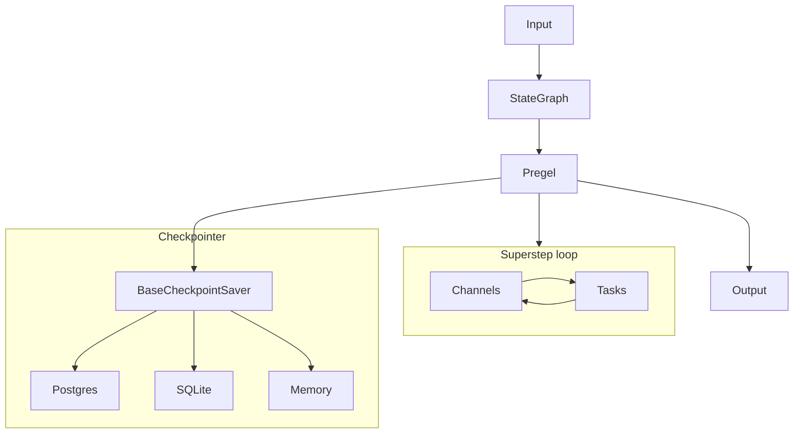

LangGraph runs durable, stateful agent and workflow executions. Most readers meet it through `StateGraph` in `libs/langgraph/langgraph/graph/state.py`, call `compile()`, and then invoke the compiled graph with a `thread_id` so the run can resume later. The official [LangGraph docs](https://docs.langchain.com/oss/python/langgraph/overview) cover the user facing model in more detail; this page maps the Python monorepo and shows how the pieces fit together. For the path from invoke to execution, see [Anatomy of an invoke](./01-anatomy-of-an-invoke.md) and [What runs next](./02-what-runs-next.md).

## The three layer model

Think about the codebase in three layers.

### Builder: `StateGraph`

`StateGraph` records the state schema, nodes, edges, branches, and reducer hints. It does not execute work. At compile time, it lowers the plan into channels and tasks, and the routing anchors in `libs/langgraph/langgraph/graph/_branch.py` feed that lowering path.

### Engine: `Pregel` and `CompiledStateGraph`

`CompiledStateGraph` subclasses `Pregel`, so the compiled graph runs on the Pregel engine in `libs/langgraph/langgraph/pregel/main.py`. The engine follows a Bulk Synchronous Parallel loop: it plans the next tasks, executes them in parallel, then applies writes at the superstep boundary. `libs/langgraph/langgraph/pregel/_loop.py` owns the loop, checkpoint lifecycle, interrupts, and resume behavior; `libs/langgraph/langgraph/pregel/_algo.py` prepares tasks, applies writes, and tracks channel versions; `libs/langgraph/langgraph/pregel/_write.py` turns node output into channel writes.

### Persistence contract: `BaseCheckpointSaver`

The checkpoint contract lives in `libs/checkpoint/langgraph/checkpoint/base/__init__.py`. `BaseCheckpointSaver` gives LangGraph the durable memory it needs for pause and resume, human in the loop, time travel, and crash recovery. `JsonPlusSerializer` in `libs/checkpoint/langgraph/checkpoint/serde/jsonplus.py` serializes checkpoint data with `ormsgpack`, and the concrete savers in `libs/checkpoint-postgres/langgraph/checkpoint/postgres/__init__.py`, `libs/checkpoint-sqlite/langgraph/checkpoint/sqlite/__init__.py`, and `libs/checkpoint/langgraph/checkpoint/memory/__init__.py` implement that contract for Postgres, SQLite, and memory.

`libs/checkpoint-conformance/README.md` defines the conformance suite that checks third party savers against the same persistence contract.

## The runtime model

Pregel treats each node like an actor that reads from channels and writes back to channels. See [Anatomy of an invoke](./01-anatomy-of-an-invoke.md) and [What runs next](./02-what-runs-next.md) for the call trace and scheduling math. The official [Pregel docs](https://docs.langchain.com/oss/python/langgraph/pregel) cover the execution model that this hub only sketches. The engine advances in supersteps, so every actor reads a stable snapshot, no actor sees writes from the same step, and the checkpoint boundary stays clean.

The compiler lowers state keys, edges, and `Send` fan out into channels and tasks. The engine then schedules the resulting tasks by channel change, so runtime state lives in versions, writes, and checkpoints instead of in a live graph object.

## How state becomes tasks

`StateGraph` compiles state keys into channels, edges into triggers, and `Send` fan out into tasks. For the channel model and the branch logic, see [Your state compiles to channels](./03-your-state-compiles-to-channels.md) and [Control flow is channels too](./04-control-flow-is-channels-too.md), along with the official [Graph API docs](https://docs.langchain.com/oss/python/langgraph/graph-api) for reducer semantics. `libs/langgraph/langgraph/channels/__init__.py` exposes the channel family that the compiler and runtime share. `libs/langgraph/langgraph/pregel/_algo.py` shows the important detail: the compiler and engine care about which channels changed and which nodes saw those changes, not about the shape of the drawn graph.

Conditional routing follows the same rule. `libs/langgraph/langgraph/graph/_branch.py` translates branch decisions into writes that feed the next step, so control flow stays inside the same channel and task model.

## Persistence is one mechanism for many behaviors

The same checkpoint mechanism powers pause and resume, human review, time travel, and crash recovery. For the checkpoint format and replay contract, see [Why checkpoints look like that](./05-why-checkpoints-look-like-that.md) and [Replay, resume, and idempotency](./06-replay-resume-and-idempotency.md), plus the official [Persistence docs](https://docs.langchain.com/oss/python/langgraph/persistence) and [Checkpointers docs](https://docs.langchain.com/oss/python/langgraph/checkpointers). A `thread_id` gives the saver a stable key for the conversation or run, and each checkpoint records the state at one boundary in the superstep timeline. Resuming picks up from the latest checkpoint, time travel forks from an earlier checkpoint, and recovery replays the same writes because the saver stores both checkpoint state and pending writes.

That is why the checkpoint layer sits beneath the engine rather than beside it. The runtime needs one durable contract for every path that crosses a boundary, whether the boundary comes from a normal step, an interrupt, or a restart after failure.

## The functional API

`@entrypoint` and `@task` in `libs/langgraph/langgraph/func/__init__.py` use the same runtime without a drawn graph. For the split between graph-shaped and function-shaped entry points, see [One engine, two APIs](./07-one-engine-two-apis.md) and the official [Functional API docs](https://docs.langchain.com/oss/python/langgraph/functional-api). The functional API compiles into Pregel, uses the same channels and checkpoints, and honors the same durability model. It exposes the engine through function-shaped entry points instead of a state graph builder.

## Supporting cast

`sdk-py`, `sdk-js`, `cli`, and `prebuilt` live in this monorepo as platform clients or tooling; `langgraphjs` is a separate JavaScript/TypeScript repository that mirrors the framework. None of those in-repo packages defines the Python execution engine in this repository. For the guide map and reading order, see [About this site](./08-about-this-site.md).

## Honest limits, as of July 2026

This page stays shallow on `DeltaChannel`, v3 streaming work, and node level error handler and graceful drain features. Those surfaces still move quickly, so the stable mental model remains `StateGraph` → `Pregel` → channels → checkpointer.

## Where to look in the code

- `libs/langgraph/langgraph/graph/state.py` — builder, `compile()`, and `CompiledStateGraph`.
- `libs/langgraph/langgraph/pregel/main.py` — engine, streaming, and execution orchestration.
- `libs/langgraph/langgraph/pregel/_loop.py` — superstep loop, interrupts, resume, and checkpoint timing.
- `libs/langgraph/langgraph/pregel/_algo.py` and `libs/langgraph/langgraph/pregel/_write.py` — task preparation, version tracking, and write dispatch.
- `libs/checkpoint/langgraph/checkpoint/base/__init__.py` — checkpoint data model and saver contract.
- `libs/checkpoint-postgres`, `libs/checkpoint-sqlite`, and `libs/checkpoint/langgraph/checkpoint/memory` — concrete saver implementations; `libs/checkpoint-conformance/README.md` — saver contract checks.
