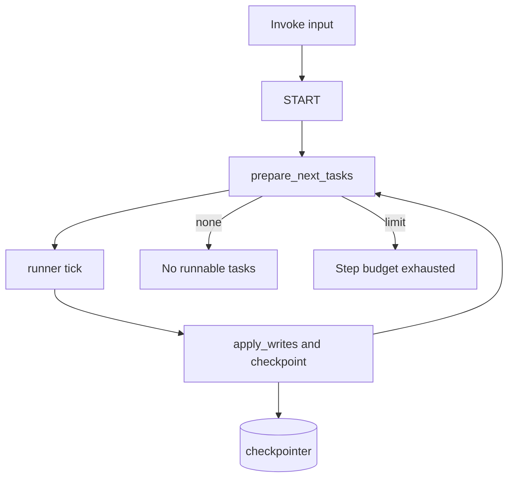

This page traces one synchronous `graph.invoke(input, config)` call through the engine that powers a compiled LangGraph graph with a `thread_id`. It shows how one request becomes a superstep loop: load checkpoint state, plan runnable tasks, execute them, apply writes, and stop with a stable result.

The official LangGraph [`pregel`](https://docs.langchain.com/oss/python/langgraph/pregel), [`graph-api`](https://docs.langchain.com/oss/python/langgraph/graph-api), and [`checkpointers`](https://docs.langchain.com/oss/python/langgraph/checkpointers) pages already cover the abstract runtime model, state and channel semantics, and checkpoint design. This page adds the code-level trace those pages omit. It sits beside the broader map in [/00-the-big-picture.md](./00-the-big-picture.md) and the API split in [/07-one-engine-two-apis.md](./07-one-engine-two-apis.md).

## 1. Entry

`Pregel.invoke` does not create a separate execution path. It calls `stream()` and drains the stream until the loop ends, then returns the final output.

The rest of this page follows the synchronous path through `libs/langgraph/langgraph/pregel/main.py`, `libs/langgraph/langgraph/pregel/_loop.py`, `libs/langgraph/langgraph/pregel/_algo.py`, `libs/langgraph/langgraph/pregel/_checkpoint.py`, and `libs/langgraph/langgraph/pregel/_runner.py`.

## 2. Loop setup

Before the first step, `_defaults()` normalizes the run config and chooses `durability="async"` unless the caller overrides it. That puts the run on the standard durability path before the loop begins.

When a `thread_id` exists, `SyncPregelLoop.__enter__` asks the checkpointer for the latest checkpoint tuple for that thread. If the saver returns nothing, the loop starts from `empty_checkpoint()`, rebuilds the live channels with `channels_from_checkpoint(...)`, and sets `stop = step + recursion_limit + 1`, which turns `recursion_limit` into a superstep budget instead of a call stack limit.

`_first()` then decides whether the run starts from fresh input or from an existing thread. Fresh input maps to the `START` path, while `None` or `Command` routes into the existing checkpoint flow; the replay and resume details live in [/06-replay-resume-and-idempotency.md](./06-replay-resume-and-idempotency.md).

## 3. Superstep loop

The sync driver loop in `main.py` runs the cycle as `while loop.tick(): runner.tick(...)`.

- **PLAN:** `loop.tick()` asks `prepare_next_tasks(...)` for the next runnable tasks. On a fresh thread, only the `START` triggered node qualifies at first; [/02-what-runs-next.md](./02-what-runs-next.md) explains the version math that opens later steps.

- **EXECUTE:** `PregelRunner.tick(...)` runs one task or many, and it runs multiple tasks concurrently when the step contains more than one. Each node hands its return values through `ChannelWrite`, which converts them into `(channel, value)` tuples and sends them to `put_writes()`; with `sync` or `async` durability, the loop records those writes as pending writes before the next checkpoint. See [/05-why-checkpoints-look-like-that.md](./05-why-checkpoints-look-like-that.md) for the durability rationale.

- **UPDATE:** `loop.after_tick()` calls `apply_writes(...)`, which groups writes by channel, updates channels, bumps versions, and advances `versions_seen` for the nodes that ran. `after_tick()` then checkpoints the step itself through `_put_checkpoint({"source": "loop"})`. [/03-your-state-compiles-to-channels.md](./03-your-state-compiles-to-channels.md) covers the reducer and channel semantics that make that update possible.

This loop follows a strict BSP boundary: current writes stay invisible, channels stay immutable within the step, and parallel tasks read the same snapshot. When two tasks try to update the same state in a way the reducer cannot combine, the engine surfaces the symptom described in [INVALID_CONCURRENT_GRAPH_UPDATE](https://docs.langchain.com/oss/python/langgraph/errors/INVALID_CONCURRENT_GRAPH_UPDATE).

## 4. Termination

The loop stops when `prepare_next_tasks(...)` finds no runnable tasks or when the step budget runs out. In the latter case, `SyncPregelLoop.tick()` sets `status` to `"out_of_steps"`, and `Pregel.stream` in `main.py` raises `GraphRecursionError` with the [`GRAPH_RECURSION_LIMIT`](https://docs.langchain.com/oss/python/langgraph/errors/GRAPH_RECURSION_LIMIT) error code after the `while loop.tick():` loop exits.

An interrupt also ends the loop, but the exit path still commits the checkpoint before `__interrupt__` reaches the caller. That keeps the saved state aligned with the interrupt boundary instead of leaving the run half advanced.

## 5. Output

After the loop ends, `read_channels(...)` collects the graph’s output channels and `invoke()` coerces that value to the output schema before it returns. The caller sees the graph’s public output shape, not the internal channel map that the engine used to compute it.

## Where to look in the code

- `libs/langgraph/langgraph/pregel/main.py` — `Pregel.invoke`, `Pregel.stream`, `_defaults`, and the synchronous superstep driver.
- `libs/langgraph/langgraph/pregel/_loop.py` — `SyncPregelLoop.__enter__`, `_first`, `tick`, `after_tick`, `_put_checkpoint`, and `_suppress_interrupt`.
- `libs/langgraph/langgraph/pregel/_algo.py` — `prepare_next_tasks(...)` and `apply_writes(...)`.
- `libs/langgraph/langgraph/pregel/_checkpoint.py` — `channels_from_checkpoint(...)`.
- `libs/langgraph/langgraph/pregel/_runner.py` — `PregelRunner.tick(...)` and `commit(...)`.
- [/08-about-this-site.md](./08-about-this-site.md) — the rest of the guide map.