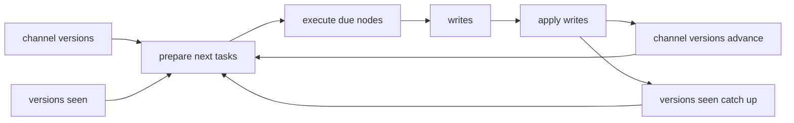

This page explains how LangGraph decides which node runs in the next superstep. The [Pregel](https://docs.langchain.com/oss/python/langgraph/pregel) and [checkpointers](https://docs.langchain.com/oss/python/langgraph/checkpointers) pages cover the scheduler model and checkpoint storage around that decision; this page covers the bookkeeping that turns stored state into the next frontier of work. See [01-anatomy-of-an-invoke.md](./01-anatomy-of-an-invoke.md), [03-your-state-compiles-to-channels.md](./03-your-state-compiles-to-channels.md), and [04-control-flow-is-channels-too.md](./04-control-flow-is-channels-too.md) for the adjacent pieces that feed this decision.

The scheduler does not keep a runtime queue for this decision and it does not walk edges from a live graph to discover work. It reads two persisted maps in the checkpoint, `channel_versions[channel_name]` and `versions_seen[node_name][channel_name]`, and it treats a node as due when one of its trigger channels is available and the current channel version is newer than the version recorded for that channel in that node’s `versions_seen` entry.

## The checkpoint is the scheduler state

These maps answer one question: did any watched channel move since the node last ran? `channel_versions` records the current version for each channel, and `versions_seen` records the last version each node has already consumed.

`prepare_next_tasks` in `libs/langgraph/langgraph/pregel/_algo.py` builds the next task set, and `_triggers` performs the version comparison for each candidate node. `apply_writes` returns the updated channel set, and `prepare_next_tasks` uses that set with `trigger_to_nodes` before comparison starts.

## Where the check happens

The loop follows a simple sequence: run, consume, write, bump, compare again. A task runs in the current superstep, `apply_writes` records that its trigger channels now count as seen, `BaseChannel.consume()` lets a channel clear or compact state, `BaseChannel.update()` applies the new writes, and `BaseChannel.finish()` closes out the frontier when nothing else remains to trigger.

`apply_writes` in `libs/langgraph/langgraph/pregel/_algo.py` updates `versions_seen` first, then it advances `channel_versions` as channels accept writes. `prepare_next_tasks` reads the saved checkpoint on the next superstep and asks the same version question again against the new frontier.

## Example: two nodes over three supersteps

The tokens in this table are opaque order markers. The scheduler compares them; it does not parse them as timestamps or counters.

| Superstep | Node that runs | `channel_versions` | `versions_seen[A][start]` | `versions_seen[B][work]` |
| --- | --- | --- | --- | --- |
| 0 | `A` | `start=α`, `work=∅`, `done=∅` | `α` | `∅` |
| 1 | `B` | `start=α`, `work=β`, `done=∅` | `α` | `β` |
| 2 | none | `start=α`, `work=β`, `done=γ` | `α` | `β` |

In this graph, `A` reacts to `start` and produces `work`, then `B` reacts to `work` and produces `done`. Each node only shows the trigger channel it watches. After `B` runs, no trigger channel advances again, so the frontier goes empty and the run stops.

## Why versions exist instead of a dirty flag

Versions make replay and crash recovery deterministic. The next frontier comes back from the checkpoint, so no in-memory queue needs to survive a crash or a restart. A node that runs without its trigger channel advancing does not run again, because `versions_seen` catches up to the current channel version and the comparison turns false on the next pass.

## Failure modes

`recursion_limit` works as a superstep budget, not as call stack depth. When the loop spends that budget, LangGraph raises `GraphRecursionError`; the user-facing troubleshooting page for [GRAPH_RECURSION_LIMIT](https://docs.langchain.com/oss/python/langgraph/errors/GRAPH_RECURSION_LIMIT) covers the error message and the usual response.

The other stop condition is quiescence. When the frontier goes empty, `prepare_next_tasks` returns nothing, `tick()` marks the run done, and `END` in `libs/langgraph/langgraph/constants.py` names that terminal path. `END` does not introduce a separate scheduler rule; it just names the stop that already happens when nothing remains due.

## Version flow

The same two maps drive every pass through the loop: planning compares them, execution produces writes, and `apply_writes` moves both maps forward for the next comparison. See [05-why-checkpoints-look-like-that.md](./05-why-checkpoints-look-like-that.md) and [06-replay-resume-and-idempotency.md](./06-replay-resume-and-idempotency.md) for the checkpoint shape and replay contract behind that flow.

## Where to look in the code

- `libs/langgraph/langgraph/pregel/_algo.py` — `prepare_next_tasks`, `_triggers`, `apply_writes`
- `libs/langgraph/langgraph/pregel/_loop.py` — `tick`, `after_tick`, `_put_checkpoint`
- `libs/checkpoint/langgraph/checkpoint/base/__init__.py` — `Checkpoint`, `channel_versions`, `versions_seen`, `BaseCheckpointSaver.get_next_version`
- `libs/langgraph/langgraph/channels/base.py` — `consume`, `update`, `finish`
- `libs/langgraph/langgraph/pregel/_checkpoint.py` — `create_checkpoint`, `channels_from_checkpoint`